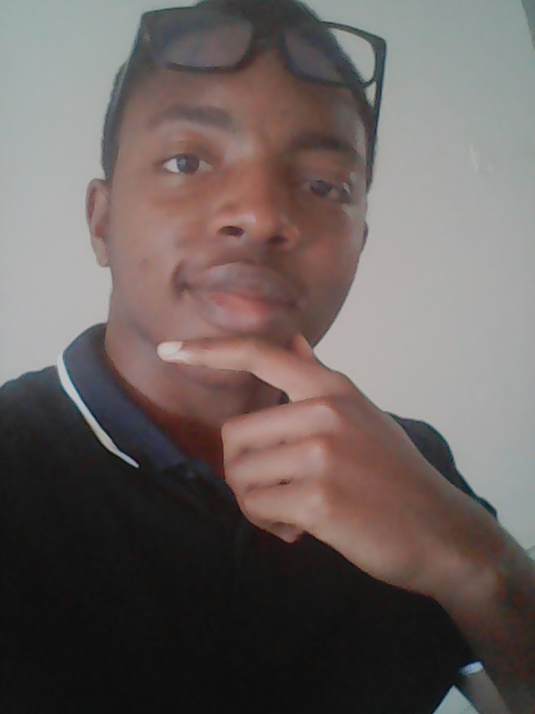

#Eric Dasse

**Eric**(Kirikou, Ricou pour les intimes...) est un étudiant d'origine camerounaise et un des personnages principaux de la série *La voie de l'informaticien : Replay!*. D'abord de nature timide et fragile au début de l'histoire, sa personnalité change radicalement au cours de son entrainement spécial pendant l'*Ellipse d'Eté*, au cours duquel il s'est endurci, pour devenir pendant la période L3 la **8ème force des enseignements du maître**. Il a également une grande affection pour ses amis sur lesquels il veille toujours.

>Etudiant traditionnellement non conventionnel, qui fait des choses extraordinairement ordinaires...

*(Pardon de me jeter des fleurs, mais voilà, ça m'a pris d'un coup...)*
